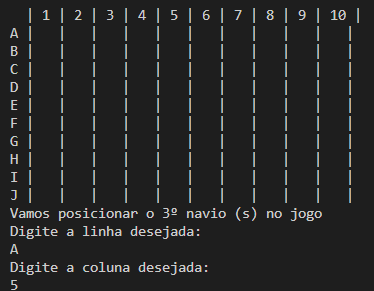
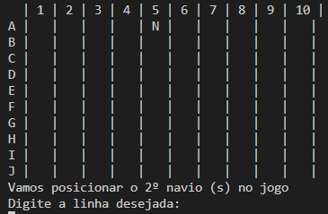
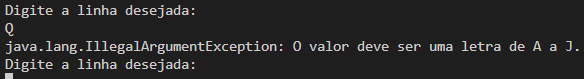

<a id='ancora'></a>
# Projeto Batalha Naval - Let's Code Ada - Automação e Testes 🚀

<br><br>

- [Sobre o Projeto](#ancora3) <br>
- [Competências Desenvolvidas](#ancora4) <br>
- [Entregável](#ancora5) <br>
- [Execução](#ancora7) <br>
- [Prints de Execução](#ancora8) <br>
- [Colaboradores](#ancora9)

<br><br>


<a id="ancora3"></a>
## Sobre o Projeto ✔️

<br>

“Batalha naval é um jogo de tabuleiro de dois jogadores, no qual os jogadores têm de adivinhar em que quadrados estão os navios do oponente. Embora tenha sido o primeiro jogo em tabuleiro comercializado e publicado pela Milton Bradley Company em 1931, o jogo foi originalmente jogado com lápis e papel.

O jogo original é jogado em duas grelhas para cada jogador - uma que representa a disposição dos barcos do jogador, e outra que representa a do oponente. As grelhas são tipicamente quadradas, estando identificadas na horizontal por números e na vertical por letras. Em cada grelha o jogador coloca os seus navios e registra os tiros do oponente.

Antes do início do jogo, cada jogador coloca os seus navios nos quadros, alinhados horizontalmente ou verticalmente. O número de navios permitidos é igual para ambos jogadores e os navios não podem se sobrepor.Após os navios terem sido posicionados o jogo continua numa série de turnos, em cada turno um jogador diz um quadrado na grelha do oponente, se houver um navio nesse quadrado, é colocada uma marca vermelha, senão houver é colocada uma marca branca.

Os tipos de navios são: porta-aviões (5 quadrados adjacentes em forma de T), os submarinos (1 quadrado apenas), barcos de dois, três e quatro canos. Numa das variações deste jogo, as grelhas são de dimensão 10x10, e o número de navios são: 1, 4, 3, 2, 1, respectivamente.”

<br>

<a id="ancora4"></a>
## Competências Desenvolvidas 📝

<br>

* JAVA;
* JAVA.utils;
* Programação Orientada a Objetos.

<br>

<a id="ancora5"></a>
## Entregável 📋

<br>

1. Em nossa versão, teremos apenas navios do tipo submarino (1 quadrado).
<br><br>
2. Cada jogador deverá posicionar em sua grelha dez submarinos.
<br><br>
3. O programa aceitará apenas um jogador, pois o oponente será o computador.
<br><br>
4. Para não precisarmos utilizar cores no terminal vamos usar as marcações:
* Navio posicionado N (ene maiúsculo);
* Tiro certeiro * (asterisco);
* Tiro na água – (traço);
* Tiro certeiro com navio posicionado X (xis maiúsculo);
* Tiro na água com navio posicionado n (ene minúsculo);
<br><br>
5. Em cada turno, a situação atual do tabuleiro do jogador deverá ser impressa na tela de acordo com a imagem disponibilizada no PDF
<br><br>
6. O código deve ser postado no GitHub e a entrega será feita com o link do projeto.
<br><br>


<a id="ancora7"></a>
## Execução 💻

<br>

1. Clone este repositório remoto em seu equipamento:
```
git clone git@github.com:franciellenocp/batalha-naval.git
```
2. Navegue até a pasta criada:
```
cd batalha-naval
```
3. Execute o arquivo em sua IDE de preferência:
```
BatalhaNaval.java
```

<br>

<a id="ancora8"></a>
## Prints de Execução 📝

<br>

### Montagem do Quadro
<br>

<br>

<br>

### Inserção de Navio
<br>

<br>

<br>

### Tratamento de Erros
<br>

<br>

<br>


<a id="ancora9"></a>
## Colaboradores 🤝

Projeto desenvolvido por:

<table>
  <tr>
    <td align="center">
      <a target="_blank" href="https://www.linkedin.com/in/franciellenocp/">
        <br>
        <sub>
          <b>Franciellen Pereira</b>
        </sub>
      </a>
    </td>
    <td align="center">
      <a target="_blank" href="https://www.linkedin.com/in/gabriel-vilarinho/">
        <br>
        <sub>
          <b>Gabriel Vilarinho</b>
        </sub>
      </a>
    </td>
    <td align="center">
      <a target="_blank" href="https://www.linkedin.com/in/jandsonmoura/">
        <br>
        <sub>
          <b>Jandson Moura</b>
        </sub>
      </a>
    </td>
    <td align="center">
      <a target="_blank" href="https://www.linkedin.com/in/eduardo-alexandre025/">
        <br>
        <sub>
          <b>Eduardo Alexandre</b>
        </sub>
      </a>
    </td>
  </tr>
</table>

<br><br>

[Voltar ao Topo](#ancora)